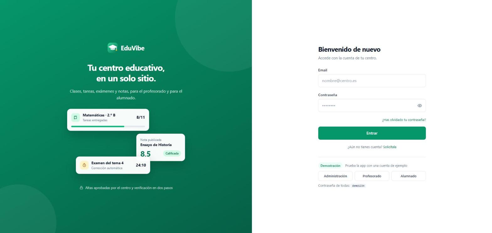
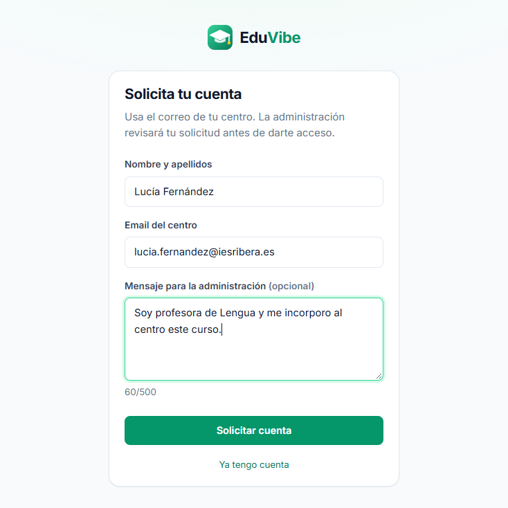
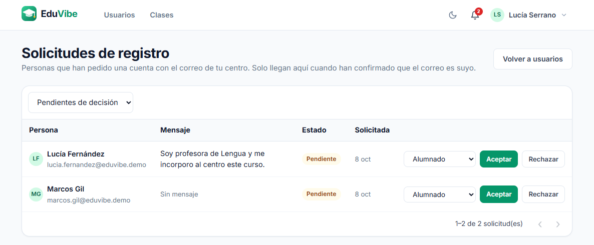
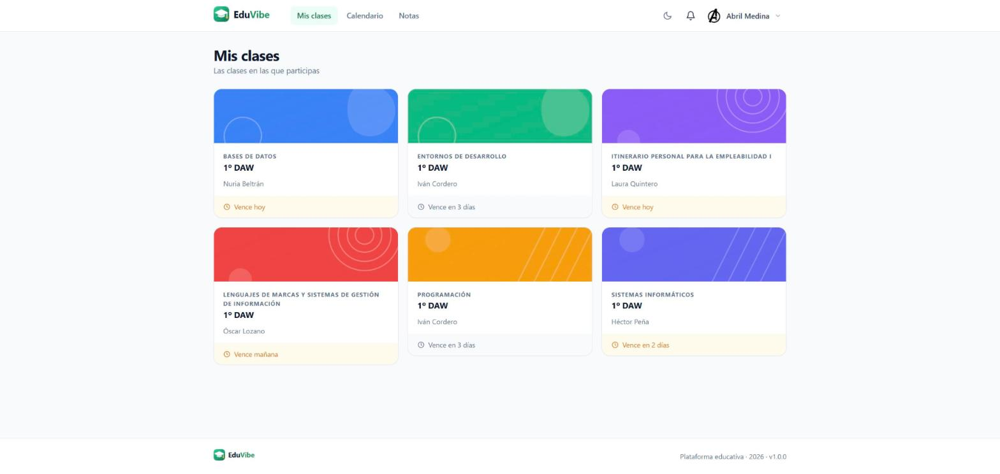
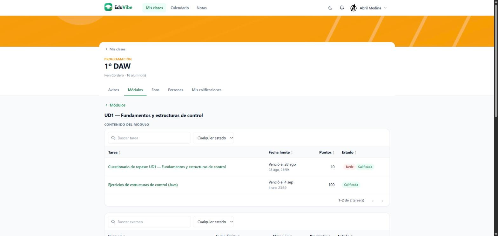

# EduVibe

**A full-stack learning management platform** that sits between Google Classroom (simplicity) and Moodle (structure): classes, assignments, timed exams, rubric grading, group submissions and discussion forums, built on a layered Spring Boot API and an Angular SPA, with all permissions resolved server-side.


## Screenshots

| Login | Request an account | Registration requests (admin) |
|---|---|---|
|  |  |  |

| My classes | Class work |
|---|---|
|  |  |

## Overview

EduVibe is a second iteration of my final degree project (TFG). The goal is to build, end to end, the parts of an education platform that portfolio projects usually skip: rubric-based grading, automatic late penalties, weighted averages, whole-team submissions, reusable question banks, and an account-security layer (2FA, session revocation, GDPR flows). Every feature was exercised by hand in the browser against the real backend before being considered done, not just compiled.

## Features

### Accounts and access
- **Invitation-based onboarding.** An admin creates the user and a single-use invitation token is emailed; the user sets their own password on acceptance. Passwords are never sent by email.
- **Registration requests with admin approval.** Anyone with an email from the organization's allowed domain can request an account, but a request is not an account: the person must first confirm their email through a single-use link, and only then does it reach an admin, who accepts it (choosing the role) or rejects it. Requesters never pick their own role or password. The form answers identically whether or not the email exists, is rate-limited per IP and globally, and has a honeypot field against bots. Organizations without an allowed domain do not accept requests.
- **Bulk user creation** from CSV, plus an admin panel with paginated, filterable user management.
- **Three roles** (admin, teacher, student). Authorization depends on the user's real relationship with each class (enrolled, owner, etc.), not on role alone, so a teacher cannot touch another teacher's class.
- **Self-service password recovery** through a single-use, expiring link.
- **Password change** from the profile, requiring the current password.

### Classes and coursework
- Classes with topics, pinnable announcements, materials (with date-based visibility restrictions) and enrollment management.
- Two per-class view modes: structured (topics → activities/materials) and flexible (everything mixed inside a topic).
- **Assignments** with due date, maximum score and file or text submissions, with an always-visible status (pending, submitted, graded, late).
- **Rubrics:** weighted criteria visible to students before submitting; the final grade is the sum of the per-criterion scores.
- **Weighted gradebook:** each assignment carries its own weight in the class average, so assignments with different maximum scores are comparable.
- **Automatic late penalty:** a configurable percentage applied at grading time.
- **Group submissions:** reusable subgroups per class; submitting or grading a group assignment propagates to every member without duplicating grade rows.
- **Grading queue** that surfaces pending submissions across all of a teacher's classes.

### Exams
- Multiple-choice questions with automatic grading and a server-enforced timer.
- **Reusable question bank** per class. Questions are copied into an exam rather than shared by reference, so editing the original never alters attempts that already happened.
- Per-student question and answer shuffling, stable across page reloads.
- Teacher-facing analytics on results.

### Communication
- Per-class discussion forum open to everyone enrolled, with message moderation.
- In-app notifications (new assignment, grade published, new announcement, and new registration requests for admins).
- Monthly calendar with assignment due dates integrated.

### Security and privacy
- **Two-factor authentication (TOTP).** Enrollment is two-step: the secret and QR are generated first, and 2FA is only activated once the user proves their authenticator app reads it correctly. Recovery codes are provided for lost devices.
- **Login rate limiting.** Temporary lockout after consecutive failures, configurable (default: 5 attempts, 15-minute lockout).
- **Real logout.** Tokens are revoked on logout, password change and account deactivation.
- **GDPR flows.** Export of personal data, and account deletion that removes everything outside the mandatory academic record while keeping graded work identifiable for the legal period.
- Profile with role-based summary and avatar upload.

## Architecture

```
┌────────────┐   HTTPS/JSON    ┌───────────────────────┐   JDBC    ┌──────────────┐
│ Angular 17 │ ──────────────▶ │ Spring Boot 3.2 (API) │ ────────▶ │ PostgreSQL 16│
│ SPA (nginx)│  Bearer JWT     │ stateless, :9090      │  Flyway   │              │
└────────────┘                 └──────────┬────────────┘           └──────────────┘
                                          │
                                  disk volume (uploads)
```

### Backend

Strict layering, with no business logic in controllers:

```
controller/   Thin REST layer: validates input, delegates to a service
service/      Business rules and permissions
repository/   Spring Data JPA; entities are never returned through the API
dto/          Input/output contracts, separate from entities
model/        JPA entities and enums
security/     JWT filter and service, 401/403 handlers
config/       Security, CORS and typed configuration properties
util/         TOTP (RFC 6238), single-use token generation, CSV parsing, client IP
```

Design decisions worth knowing about:

- **Centralized authorization.** `ClassAccessService` is the single place that answers "who can see or edit what" for a class; endpoints are additionally protected by role rules in `SecurityConfig`.
- **Stateless JWT with server-side revocation.** Each token carries an id; revoked ids are stored until they expire, and users carry a `token_version` that is bumped to invalidate every session at once. Expired revocations are purged periodically.
- **Registration requests are not accounts.** A public request creates a row in its own table, never a user: nothing can sign in until an admin approves it, and an unconfirmed email never reaches the admin. The organization is deduced from the email's domain, the requester picks neither role nor password, and the endpoint answers identically whether or not the email, the domain or an account exists, so it cannot be used to discover who is registered. Abuse limits are enforced per IP and platform-wide, and `X-Forwarded-For` is only trusted when a proxy is explicitly declared (`TRUSTED_PROXY`), because otherwise the header can be forged to dodge the limit.
- **Hashed single-use tokens.** Invitation, password-reset and email-confirmation tokens have 256 bits of entropy; only their SHA-256 hash is stored, so a database leak does not expose pending links. Passwords use BCrypt.
- **TOTP implemented in-house** (HMAC-SHA1 per RFC 4226/6238) and verified against the RFC test vectors. Recovery codes use an alphabet without ambiguous characters and are stored hashed.
- **Safe uploads.** Files are stored under a generated UUID name (never the client's), checked against an extension allow-list per upload type, with resolved paths normalized against the upload root and a 15 MB size limit.
- **Schema under version control.** Flyway migrations (V1–V20) with `ddl-auto=validate`; Hibernate never alters the schema. `open-in-view` is disabled.
- **Constructor injection** throughout (no field `@Autowired`), UUID primary keys, and server-side pagination (default 10, max 50).
- **Demo data** is a repeatable Flyway migration (`db/demo`) selected via configuration, not hardcoded in application code.

### Frontend

- **Angular 17 standalone components**, lazy-loaded per route with `loadComponent`, and state held in signals (`signal` / `computed`) without NgRx.
- **Route protection declared once**: a session guard on the layout's parent route covers every child, so a new screen cannot ship unprotected by oversight. Role guards (admin, teacher, student) and a guest guard for login/recovery.
- **HTTP interceptor** attaches the JWT; components never call `HttpClient` directly, only one service per domain (`TareasService`, `ForoService`, ...).
- **Custom design system**, with no Material or Bootstrap: generic sortable/filterable/paginated data table, paginator, dialogs, status pills, empty states, and a custom confirmation dialog in place of `window.confirm`.
- Client-side list utilities (filtering, sorting, pagination, weighted average) are covered by unit specs.
- Served by nginx with a `try_files` fallback to `index.html` so deep links (invitations, password reset) don't return 404.

## Tech stack

| Layer | Technology |
|---|---|
| Backend | Java 17, Spring Boot 3.2 (Web, Security, Data JPA, Validation, Mail), JJWT, Lombok |
| Frontend | Angular 17, TypeScript 5.4, RxJS 7.8 |
| Database | PostgreSQL 16, Flyway |
| Testing | JUnit 5, Mockito, Spring Security Test (159 backend test cases) |
| Infrastructure | Docker Compose (API + frontend + Postgres), nginx, named volumes for data and uploads |

## Getting started

### With Docker (recommended)

```bash
docker compose -f Docker-compose.yml up -d --build
```

| Service | URL |
|---|---|
| Frontend | http://localhost |
| API | http://localhost:9090 |
| PostgreSQL | localhost:5432 |

The seeded database includes three demo accounts (admin, teacher, student), all with the password `demo1234`.

### Local development

```bash
# Database
docker compose -f Docker-compose.yml up -d db

# Backend (port 9090)
cd src-api/EduvibeBackend && ./mvnw spring-boot:run

# Frontend (port 4200)
cd src-frontend/EduVibeFront && npm install && npm start
```

When running the frontend on `:4200` against the dockerized API, add that origin to `CORS_ALLOWED_ORIGINS`.

### Running the tests

```bash
cd src-api/EduvibeBackend && ./mvnw test
```

## Configuration

Everything is driven by environment variables, with defaults suitable for local development.

| Variable | Default | Purpose |
|---|---|---|
| `BBDD_HOST` / `BBDD_PORT` / `BBDD_NAME` | `localhost` / `5432` / `eduvibe` | Database connection |
| `DATABASE_USERNAME` / `DATABASE_PASSWORD` | `eduvibe` / `eduvibe` | Database credentials |
| `APP_PORT` | `9090` | API port |
| `JWT_SECRET` | *(none)* | Signing key for JWTs. **Must be set** outside local development |
| `JWT_EXPIRATION_HOURS` | `8` | Token lifetime |
| `CORS_ALLOWED_ORIGINS` | `http://localhost:4200,http://localhost` | Comma-separated allowed origins |
| `FRONTEND_URL` | `http://localhost:4200` | Base URL used in emailed links |
| `MAIL_HOST` / `MAIL_PORT` / `MAIL_USERNAME` / `MAIL_PASSWORD` | `smtp.gmail.com` / `587` / empty / empty | SMTP for invitations, registration and password recovery |
| `MAIL_FROM` | `MAIL_USERNAME` | Sender address, for providers whose SMTP user is not an email address |
| `INVITATION_EXPIRATION_HOURS` | `48` | Invitation validity |
| `REGISTRATION_VERIFICATION_EXPIRATION_HOURS` | `24` | Validity of the email-confirmation link for registration requests |
| `REGISTRATION_MAX_PER_IP_PER_HOUR` / `REGISTRATION_MAX_PER_HOUR` | `5` / `100` | Registration requests allowed per IP, and platform-wide, per hour |
| `TRUSTED_PROXY` | `false` (`true` in Docker Compose) | Read the client IP from `X-Forwarded-For`. Only enable behind your own proxy: otherwise the header can be forged to dodge the per-IP limit |
| `PASSWORD_RESET_EXPIRATION_MINUTES` | `60` | Reset-link validity |
| `LOGIN_MAX_FAILED_ATTEMPTS` / `LOGIN_LOCKOUT_MINUTES` | `5` / `15` | Login rate limiting |
| `UPLOADS_DIR` | `uploads` | Upload directory (a volume in Docker) |
| `FLYWAY_LOCATIONS` | `classpath:db/migration,classpath:db/demo` | Drop `db/demo` to skip demo data |
| `SPRING_PROFILES_ACTIVE` | *(none)* | With `prod`, the API refuses to start without `JWT_SECRET` |
| `ADMIN_EMAIL` / `ADMIN_PASSWORD` | empty | First admin, created only when the database has no users (min. 12 characters) |
| `ADMIN_NAME` / `ORGANIZATION_NAME` | `Administrador` / `EduVibe` | Name of that admin and of the initial organization |

## Production deployment

```bash
cp .env.example .env.production      # fill in the secrets; this file is git-ignored
docker compose --env-file .env.production \
  -f Docker-compose.yml -f Docker-compose.prod.yml up -d --build
```

`Docker-compose.prod.yml` activates the `prod` profile (mandatory `JWT_SECRET`), skips the demo data so no known credentials exist, creates the first admin from `ADMIN_EMAIL` / `ADMIN_PASSWORD` on an empty database, and stops publishing PostgreSQL on the host. After the first start, change the admin password from the profile page and remove `ADMIN_PASSWORD` from the env file.

## Free deployment

The project also deploys on free tiers: **Neon** (PostgreSQL), **Render** (the API, from `render.yaml`) and **Vercel** (the Angular app, which forwards `/api` to the API). Step-by-step guide in [docs/DESPLIEGUE-RENDER.md](docs/DESPLIEGUE-RENDER.md). Every push to `main` redeploys; Flyway applies new migrations on startup. The free API sleeps after inactivity and its disk is not persistent, so it suits a public demo, not production.

## Repository structure

```
src-api/EduvibeBackend/     REST API (Spring Boot)
src-frontend/EduVibeFront/  SPA (Angular)
docs/                       Project report, deployment guide and screenshots
Docker-compose.yml
render.yaml                 Render blueprint for the free deployment
eduvibe-spec.md             Product specification and roadmap
```

## Author

**Javier Pintado Navarro** — [GitHub](https://github.com/javipintado3) · [LinkedIn](https://www.linkedin.com/in/javier-pintado-navarro-06811a2ab/) · [Portfolio](https://javier-pintado-portfolio.vercel.app/)
